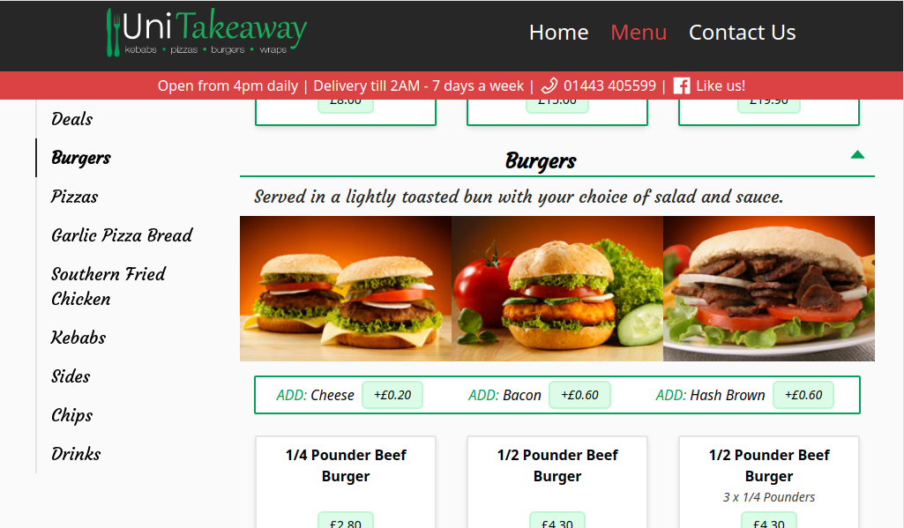
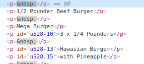

# UniTakeaway site

  
<h2 style="display: inline-block">Table of Contents</h2>

  <ol>
    <li>
      <a href="#about-the-project">About The Project</a>
      <ul>
        <li><a href="#built-with">Built With</a></li>
        <li><a href="#comparison">Comparison</a></li>
      </ul>
    </li>
  </ol>

## About The Project
This project is a redesign of Uni Takeaway's old website, I have kept to the brand colours and general layout of the site while adding in my own design. 

### Built With
- React
- Tailwind

### Comparison

Old site @ 1024x600

Redesign @ 1024x600

Review:
- Updating the Menu
  - A huge issue with the old site is that it was designed using a software no longer in use. This meant when amending the site, in order to ensure you updated the right menu item price, you would need to physically go through the site html in a live environment to know what price to update...
  
  Gaps were made using empty paragraph tags and prices were in a separate column altogether making them hard to match up to respective items:

- Responsiveness
  - The way the old site works is that it redirects mobile users to /phone/index.html and lacks any changes for window size.
  - In addition, the owners couldn't add all menu items to their menu online!! Because the white space was fixed, so for example: 'deals' you would have noticed missing deal 'numbers' as the owners had to take off items in order for it to all to fit.
  - This is all done responsively now, so an unlimited amount of menu items could be added and the menu navigation and menu will update appropriately.
- Images
  - Most items on the old site are images, even the green text at the top of the home page, this leads to blurry images and lack of responsiveness. All text images have been replaced with responsive text.
  - Menu images are addable to the menu items, and have a rule whereby only 1 image per a menu set will appear on smaller screens.
- Pricing
  - It is much easier to match prices to their respective items from looking at the website, as they are within a box and do not have a large gap or image in between them.
- Menu navigation
  - Doesn't use images, so is more performant.
  - Sticks, easier to navigate the menu freely without being stuck to a single menu page.
  - Easier to change in future by changing the import items.
- Links
  - The facebook link is actually usable and not just an image
- Food hygiene label
  - There is a script to the governments hygiene rating which should update itself if the rating changes. 

Old site vs Redesign @ 360x640

Review:
- Legibility 
  - The site was barely readable on mobile view due to the use of images instead of text and for menu navigation 
- Responsiveness
  - As mentioned previously, it's fairly difficult to read items on mobile view as they do not scale well, I use flex box mainly so items will wrap.
  - Additionally, you will notice white space on the right side of the old website, due to lack of responsiveness
- Navigation header
  - I added a responsive navbar which means navigation links aren't hard to click or difficult to see on mobile.
- Menu navigation
  - instead of a sticky menu navigation as I did on larger screens, on mobile (after a refresh if you are using desktop to test this) the menu headers are collapsible.